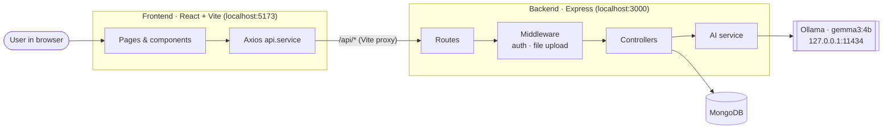
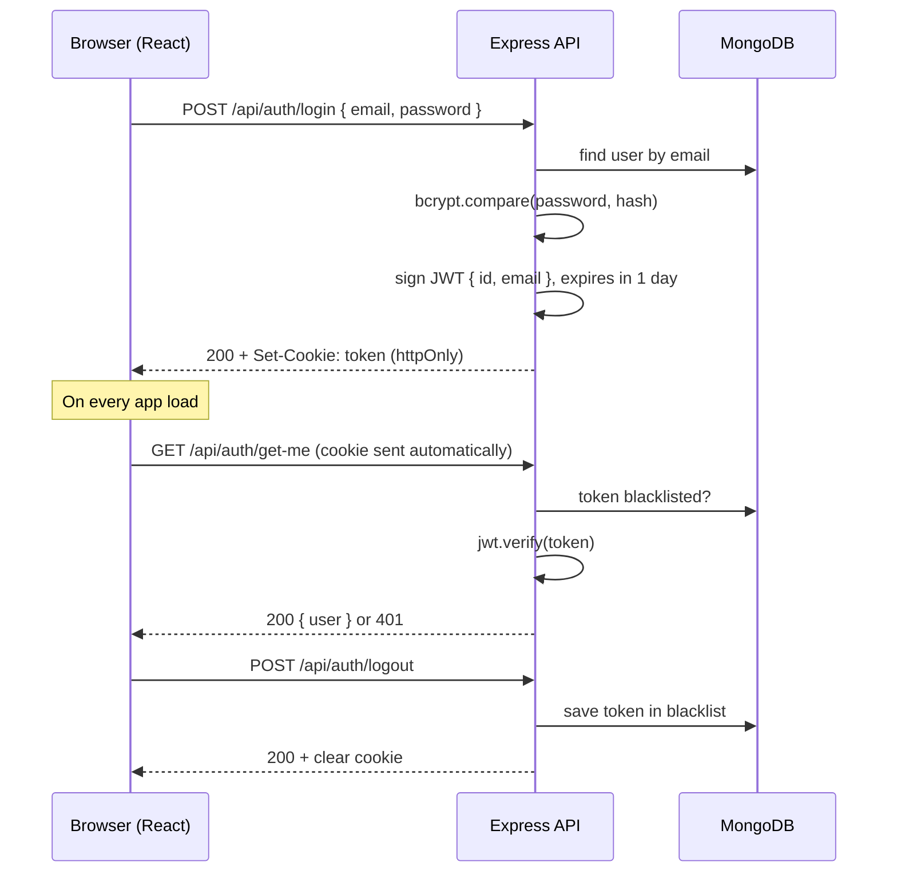
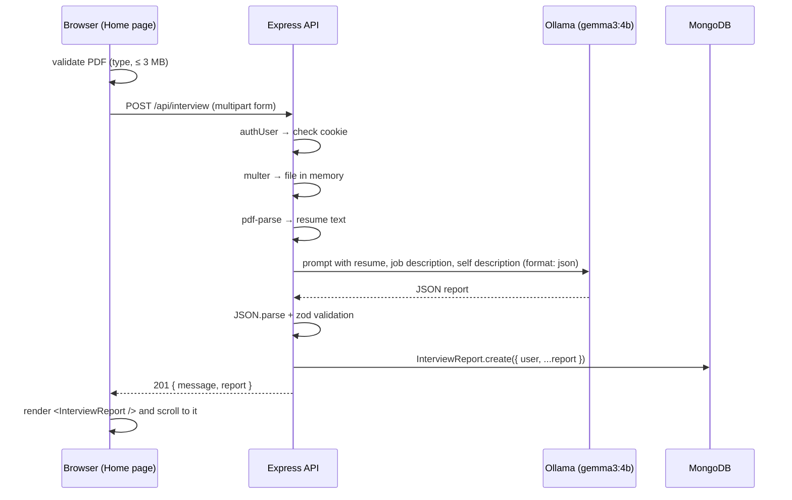

# Architecture

This document explains how the ATS Resume app is built: the tech stack, how the pieces talk to each other, how the code is organised, and what data is stored. For setup and run instructions, see [README.md](./README.md).

---

## 1. High-level overview



- The **frontend** is a single-page React app. It never calls the AI or database directly; it only calls the backend's `/api` endpoints.
- In development, **Vite proxies** `/api/*` requests from `localhost:5173` to `localhost:3000`. The browser sees one origin, so no CORS setup is needed and the login cookie works.
- The **backend** is a REST API. It handles authentication, reads the uploaded PDF, asks the local AI model for a report, validates the result and saves it in MongoDB.
- **Ollama** runs the `gemma3:4b` language model locally, so resume data never leaves your machine for AI processing.

---

## 2. Tech stack

### Frontend

| Technology | Purpose |
| ---------- | ------- |
| **React 19** | UI library |
| **Vite 8** | Dev server with hot reload, production bundler, `/api` proxy |
| **React Router 8** | Client-side routing and route guards |
| **Axios** | HTTP client with a shared instance and error interceptor |
| **Sass (SCSS)** | Styling with BEM class names and CSS variables (light/dark theme) |
| **ESLint** | Linting, including React Hooks rules |
| **Vitest + React Testing Library + jsdom** | Component, hook and API client tests |

### Backend

| Technology | Purpose |
| ---------- | ------- |
| **Node.js + Express 5** | HTTP server and routing |
| **MongoDB + Mongoose 9** | Database and schema/models |
| **jsonwebtoken** | Signs and verifies login tokens (JWT) |
| **bcryptjs** | Hashes passwords |
| **cookie-parser** | Reads the `token` cookie |
| **body-parser** | Parses JSON and URL-encoded bodies |
| **multer** | Handles the resume file upload (kept in memory, 3 MB limit) |
| **express-rate-limit** | Limits login, register and report requests |
| **pdf-parse** | Extracts text from the uploaded PDF |
| **ollama** | Client for the local Ollama AI server |
| **zod** | Validates the AI's JSON output before it is saved |
| **dotenv** | Loads environment variables from `.env` |
| **nodemon** | Auto-restarts the server in development |
| **node:test** | Built-in Node test runner and mocks for the backend tests (no extra packages) |

### Infrastructure

| Component | Purpose |
| --------- | ------- |
| **MongoDB Atlas or local MongoDB** | Persistent storage |
| **Ollama** running `gemma3:4b` | Local AI model that generates the report |

---

## 3. Folder structure

### Backend

```
backend/
├── server.js                    # Entry point: loads env, connects to DB, starts server on PORT (default 3000)
├── env.sample                   # Template for .env
├── tests/                       # node --test suites; models, PDF parser and Ollama are stubbed
└── src/
    ├── app.js                   # Express app: middleware + mounts /api/auth and /api/interview
    ├── config/
    │   ├── config.js            # Reads env vars (MONGO_URI, TOKEN required; PORT, OLLAMA_* optional)
    │   └── database.js          # Connects Mongoose to MongoDB
    ├── routes/
    │   ├── auth.routes.js       # /api/auth/*
    │   └── interview.routes.js  # /api/interview
    ├── middleware/
    │   ├── auth.middleware.js   # authUser: checks JWT cookie and blacklist
    │   ├── file.middleware.js   # multer config: memory storage, 3 MB limit
    │   └── rateLimit.middleware.js # login, register and report rate limits
    ├── controllers/
    │   ├── auth.controllers.js      # register, login, logout, get-me
    │   └── interview.controllers.js # parse PDF → AI → save report
    ├── services/
    │   └── ai.service.js        # Builds the prompt, calls Ollama, validates with zod
    └── models/
        ├── user.model.js
        ├── blacklist.model.js
        └── interviewReportModel.model.js
```

The backend follows a **routes → middleware → controllers → services/models** layering:

- **Routes** only map URLs to middleware and controllers.
- **Middleware** handles cross-cutting concerns such as auth and file upload.
- **Controllers** handle the HTTP request and response.
- **Services** hold the business logic that isn't HTTP-specific (the AI call).
- **Models** define the MongoDB collections.

### Frontend

```
frontend/
├── vite.config.js               # React plugin + /api proxy to :3000 + Vitest config
└── src/
    ├── test/                    # Vitest setup and the renderWithAuth test helper (tests sit next to their code)
    ├── main.jsx                 # Renders <App /> and global styles
    ├── App.jsx                  # Wraps the router in <AuthProvider>
    ├── app.routes.jsx           # Route table with protected/guest guards
    ├── style.scss               # Global styles, theme variables, buttons, alerts
    ├── services/
    │   └── api.service.js       # Shared Axios instance, error normalisation, 401 handler
    ├── hooks/
    │   └── useApi.js            # Tracks loading / success / error for any API call
    ├── components/              # Reusable UI: FormField, FileField, SubmitButton, Loader
    ├── auth/                    # Authentication feature
    │   ├── context/             # AuthProvider + AuthContext (current user, login, logout)
    │   ├── hooks/useAuth.js     # Reads AuthContext
    │   ├── services/auth.api.js # /auth API calls
    │   ├── components/          # ProtectedRoute, GuestRoute
    │   └── pages/               # Login, Register
    └── home/                    # Interview report feature
        ├── services/interview.api.js          # POST /interview
        ├── components/InterviewReport/        # Renders the report
        └── pages/Home/                        # Form + report on one page
```

The frontend is organised **by feature** (`auth/`, `home/`). Each feature keeps its own pages, components, services and hooks. Code shared across features lives in the top-level `components/`, `hooks/` and `services/`.

---

## 4. API reference

All endpoints are prefixed with `/api`. Protected endpoints need the `token` cookie that login/register sets.

| Method | Endpoint | Auth | Body | Response |
| ------ | -------- | ---- | ---- | -------- |
| `POST` | `/api/auth/register` | Public | JSON `{ username, email, password }` | `201` `{ message, user }` and sets `token` cookie |
| `POST` | `/api/auth/login` | Public | JSON `{ email, password }` | `200` `{ message, user }` and sets `token` cookie |
| `POST` | `/api/auth/logout` | Public | – | `200` `{ message }`, blacklists and clears the cookie |
| `GET`  | `/api/auth/get-me` | Protected | – | `200` `{ user: { id, username, email } }` |
| `POST` | `/api/interview` | Protected | `multipart/form-data`: `resume` (PDF file), `jobDescription`, `selfDescription` | `201` `{ message, report }` |
| `GET`  | `/api/interview` | Protected | – | `200` `{ reports: [{ _id, jobDescription, matchScore, createdAt }] }`, newest first, current user only |
| `GET`  | `/api/interview/:id` | Protected | – | `200` `{ report }` (full report), or `404` if it doesn't exist or belongs to another user |

Errors are returned as `{ message: "..." }` with a `4xx` or `5xx` status. The frontend shows this `message` to the user.

### Rate limits

Defined in `backend/src/middleware/rateLimit.middleware.js`. When a limit is hit the API returns `429` with a `{ message }` explaining when to retry, plus a standard `RateLimit` header.

| Endpoint | Limit | Counted per |
| -------- | ----- | ----------- |
| `POST /api/auth/login` | 10 **failed** attempts per 15 minutes | IP address |
| `POST /api/auth/register` | 5 requests per hour | IP address |
| `POST /api/interview` | 10 reports per hour | signed-in user |

Counters are kept in memory, so they reset when the server restarts and aren't shared between multiple server instances.

---

## 5. Key flows

### 5.1 Authentication



How it works:

- The JWT is stored in an **httpOnly cookie**, so JavaScript in the page can't read it. This protects the token against XSS theft. The browser attaches the cookie to `/api` requests automatically (`withCredentials: true`).
- Logging out **blacklists** the token in MongoDB, so it can't be reused even before it expires.
- On the frontend, `AuthProvider` calls `get-me` when the app starts to restore the session. While it waits, `ProtectedRoute` shows a loader.
- If any API call returns `401`, the Axios interceptor in `api.service.js` clears the user, and the route guards redirect to `/login`.

### 5.2 Generating an interview report



Step by step:

1. **Frontend validation**: `Home.jsx` checks that the resume is a PDF under 3 MB before sending anything.
2. **Upload**: `interview.api.js` sends a `FormData` request with a 2-minute timeout, because local AI generation is slow.
3. **Auth and upload middleware**: `authUser` checks the cookie. `multer` keeps the file in memory; it is never written to disk.
4. **PDF parsing**: `pdf-parse` extracts plain text from the PDF buffer.
5. **AI generation**: `ai.service.js` builds a prompt that asks for one JSON object with exact field names. It calls Ollama with `format: "json"` so the model is forced to output JSON.
6. **Validation**: the response is parsed and checked with a **zod** schema. The score must be 0–100, severity must be `low | medium | high`, and every field must be present. Invalid output is rejected instead of being saved.
7. **Persistence**: the controller saves the report together with the user id, resume text and inputs.
8. **Rendering**: `Home.jsx` passes `data.report` to `<InterviewReport />`, which shows the score, skill gaps, expandable Q&A and the preparation plan on the same page.

If any step fails, the controller returns `500 { message }`, and the error appears in a red alert above the submit button.

---

## 6. Data models (MongoDB)

### `users`

| Field | Type | Notes |
| ----- | ---- | ----- |
| `username` | String | required, unique |
| `email` | String | required, unique |
| `password` | String | bcrypt hash (10 salt rounds), never returned by the API |

### `blacklisttokens`

| Field | Type | Notes |
| ----- | ---- | ----- |
| `token` | String | JWT that was logged out |
| `createdAt`, `updatedAt` | Date | automatic timestamps. A TTL index deletes each entry 1 day after `createdAt`, when the token has expired anyway. |

### `interviewreports`

| Field | Type | Notes |
| ----- | ---- | ----- |
| `user` | ObjectId → `users` | owner of the report |
| `jobDescription` | String | required |
| `resume` | String | text extracted from the PDF |
| `selfDescription` | String | |
| `matchScore` | Number | 0–100 |
| `technicalQuestions` | `[{ question, intention, answer }]` | |
| `behavioralQuestions` | `[{ question, intention, answer }]` | |
| `skillGaps` | `[{ skill, severity }]` | severity: `low` · `medium` · `high` |
| `preparationPlan` | `[{ day, focus, task }]` | `day` is a number starting at 1 |
| `createdAt`, `updatedAt` | Date | automatic timestamps |

---

## 7. Frontend design patterns

- **Single API client** (`services/api.service.js`): one Axios instance with `baseURL: "/api"` and cookies enabled. An interceptor turns every failure into an `ApiError` with a readable `message` for timeouts, network errors and server errors, and calls a global handler on `401`.
- **`useApi` hook**: wraps any API function and exposes `execute`, `data`, `error`, `isLoading` and `isSuccess`. It never throws, and it ignores responses from outdated requests, so components stay short and consistent.
- **Auth context**: `AuthProvider` owns the current user and exposes `login`, `register` and `logout` through `useAuth()`.
- **Route guards**: `ProtectedRoute` only lets signed-in users through. `GuestRoute` keeps signed-in users away from Login and Register.
- **Feature folders plus shared components**: each feature (`auth`, `home`) stays self-contained, and form building blocks (`FormField`, `FileField`, `SubmitButton`, `Loader`) are reused everywhere.
- **Styling**: SCSS with BEM naming (`block__element--modifier`) and CSS custom properties, which switch automatically between light and dark themes via `prefers-color-scheme`.

---

## 8. Configuration

| Setting | Where | Value |
| ------- | ----- | ----- |
| `MONGO_URI` | `backend/.env` | MongoDB connection string |
| `TOKEN` | `backend/.env` | JWT signing secret |
| `PORT` | `backend/.env` (optional) | Backend port, default `3000` |
| `OLLAMA_HOST` | `backend/.env` (optional) | default `http://127.0.0.1:11434` |
| `OLLAMA_MODEL` | `backend/.env` (optional) | default `gemma3:4b` |
| Upload size limit | `backend/src/middleware/file.middleware.js` and `frontend/src/home/pages/Home/Home.jsx` | 3 MB (keep both in sync) |
| API proxy | `frontend/vite.config.js` | `/api` → `http://localhost:3000` |
| Request timeout | `frontend/src/services/api.service.js` / `interview.api.js` | 30 s default, 120 s for reports |
| JWT lifetime | `JWT_EXPIRES_IN_SECONDS` in `backend/src/config/config.js` | 1 day (also used for the cookie and the blacklist TTL) |
| Rate limits | `backend/src/middleware/rateLimit.middleware.js` | see [Rate limits](#rate-limits) |

---

## 9. Known limitations and next steps

- **Production serving**: there is no production setup yet. The Vite proxy only works in development, so a deployment needs a reverse proxy (for example Nginx) or Express serving `frontend/dist`.
- **Report history UI**: the API can list and return past reports, but the frontend has no page for them yet.
- **Tests**: unit and HTTP-level tests replace MongoDB and Ollama with test doubles, so nothing checks the app against a real database or model end to end yet.

The full, up-to-date task list is in the [TODO section of the README](./README.md#11-todo).
